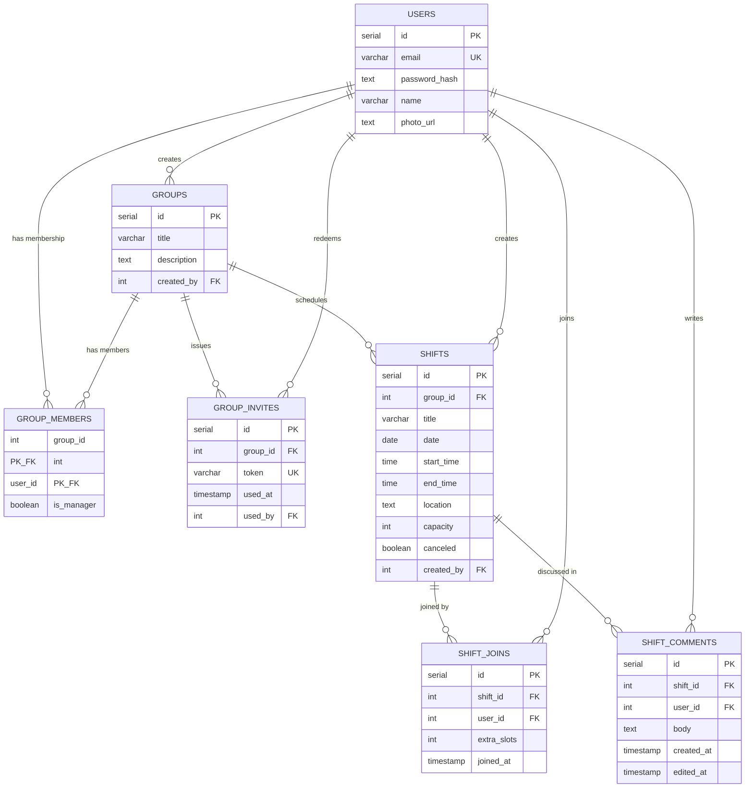

# Catering Shifts Planner

A full-stack platform for catering businesses to organize and staff their event shifts.
The app is organized around **groups** (catering teams / crews), each with its own schedule of **shifts** that members can browse, join, leave, and discuss via comments.

- **Web app** (`catering-web`) — primary application: full functionality for users, groups, shifts, comments and group management.
- **Mobile app** (`cetaring-shifts-planner-mobile`) — companion Expo app with core member functionality: login/register, browse shifts, join/leave, manage extra slots, comment.

Live deployments:
- Web: https://catering-planner-web.netlify.app
- REST API docs: https://catering-planner-web.netlify.app/api/docs

---

## Table of Contents

- [Project Description](#project-description)
- [Tech Stack](#tech-stack)
- [Architecture](#architecture)
- [User Roles & Permissions](#user-roles--permissions)
- [Database Schema Design](#database-schema-design)
- [REST API (Mobile)](#rest-api-mobile)
- [Getting Started](#getting-started)
- [Demo Credentials](#demo-credentials)
- [Project Structure](#project-structure)

---

## Project Description

Catering Shifts Planner helps catering companies coordinate staff across events. Managers create **groups** (teams), schedule **shifts** (events with date, time, location and capacity), and invite staff to join. Group members can see which shifts are upcoming, current or past, sign up (optionally bringing along extra people via "extra slots"), see who else is staffed on a shift, and leave comments to coordinate ("running 10 minutes late", "can I bring a friend?", etc.).

The web app is the primary surface — it covers everything from authentication and profile management to group/shift CRUD and member administration. The mobile app focuses on the day-to-day needs of a staff member: checking the schedule, joining/leaving shifts on the go, and chatting in the comments.

---

## Tech Stack

| Layer | Technologies |
|-------|--------------|
| **Back-end** | TypeScript · Next.js (Server Actions + REST API routes) · Drizzle ORM · Neon serverless PostgreSQL |
| **Front-end** | TypeScript · Next.js · React · Tailwind CSS |
| **Mobile** | React Native · Expo · Expo Router |
| **Auth** | bcrypt password hashing · JWT (HTTP-only cookie for web, `Authorization: Bearer` header for mobile) |
| **Deployment** | Netlify (serverless functions) · Neon (serverless PostgreSQL) |

---

## Architecture

```
catering-planner/                  ← root (npm workspaces)
├── package.json                   ← workspace scripts (dev/build/lint for both apps)
├── build_planner.md               ← step-by-step build plan / progress tracker
├── catering-web/                  ← Next.js web app (back-end + front-end)
│   ├── src/app/                   ← pages, layouts & Server Actions (App Router)
│   ├── src/app/api/               ← RESTful API route handlers (consumed by mobile)
│   ├── src/services/              ← business logic / service layer
│   ├── src/db/                    ← Drizzle schema, seed scripts, db client
│   ├── src/drizzle/               ← Drizzle migrations
│   └── package.json
└── cetaring-shifts-planner-mobile/← Expo mobile app
    ├── src/                       ← React Native screens, components, lib
    └── package.json
```

- **Client ↔ server:**
  - Web client talks to the Next.js back-end through **Server Actions** (no separate REST layer needed for the web UI).
  - Mobile client talks to the same Next.js back-end through a minimal **REST API** (`/api/*`), authenticated with a JWT Bearer token. There is no separate mobile back-end.
- **Service layer:** all business logic lives in `catering-web/src/services/`, shared between Server Actions and REST route handlers, so both clients enforce identical rules.
- **Server components by default:** Next.js pages are server components; client components are used only where browser interaction (forms, optimistic UI, clipboard, etc.) is required.
- **Server-side paging:** lists of shifts, group members, comments and dashboard sections are paged at the SQL level to keep the UI responsive on large datasets (the project was seeded with ~3,000 users / ~5,000 shifts / 500 groups for performance testing).
- **Computed shift state:** a shift's status (`upcoming` / `current` / `past` / `canceled` / `full` / `under capacity` / `over capacity`) is derived at query time from `date`, `startTime`, `capacity` and `canceled` rather than stored, so it's always accurate.

---

## User Roles & Permissions

| Role | Capabilities |
|------|--------------|
| **Visitor** | View the home page · register (email + password) |
| **User** | Manage own profile · create a group · join a group via invitation link |
| **Group Member** | View the group's shifts · join / leave a shift (with optional extra slots) · view the participant list · post / edit / delete own comments · share a shift link · leave the group |
| **Group Manager** | Everything a member can do, plus: create / edit / cancel / delete shifts in the group · generate & share group invite links · promote members to manager / demote managers · remove members · edit or delete **any** member's comment |

Notes:
- Group joining is **invite-only** — there is no public group search; users join exclusively via a one-time invite link (`/groups/[id]/join?code=…`).
- A manager is simply a regular user who created the group (auto-promoted) or was promoted by an existing manager — there is no separate "manager" account type.
- A shift stays in its **current** state for **1 hour** after its start time, then becomes **past**.
- Reaching full capacity does not block joining — over-capacity situations are resolved by the staff themselves.

---

## Database Schema Design

Schema is defined with Drizzle ORM in [`catering-web/src/db/schema.ts`](catering-web/src/db/schema.ts), backed by Neon serverless PostgreSQL. Design principles:

- **Simple integer (serial) primary keys** throughout — no UUIDs, per project requirements.
- **No stored derived state** — a shift's `upcoming` / `current` / `past` / `canceled` / `full` status is computed at query time from `date`, `start_time`, `capacity` and `canceled`, so it can never drift out of sync.
- **Composite primary key on `group_members`** (`group_id`, `user_id`) — a user can only belong to a group once, and the row's `is_manager` flag doubles as the role assignment (no separate roles table).
- **Targeted indexes** added after performance testing with ~3,000 users / 500 groups / ~5,000 shifts: `group_members_user_id_idx` (groups-by-user lookups), `shifts_group_id_date_idx` + `shifts_date_idx` (group/date filtering and sorting), `shift_joins_shift_id_idx` / `shift_joins_user_id_idx`, `group_invites_group_id_idx`, and `shift_comments_shift_id_idx` (composite with `created_at` for chronological listing).
- **No FK cascades** — dependent rows (joins, comments, shifts, invites, memberships) are deleted explicitly in the service layer in FK-safe order whenever a shift or group is removed.

### Entity-relationship diagram



### Table reference

### `users`
| Column | Type | Notes |
|---|---|---|
| id | serial PK | |
| email | varchar(255) | unique, not null |
| password_hash | text | bcrypt hash |
| name | varchar(255) | |
| photo_url | text | optional |

### `groups`
| Column | Type | Notes |
|---|---|---|
| id | serial PK | |
| title | varchar(255) | |
| description | text | optional |
| created_by | int → `users.id` | creator, auto-assigned as manager |

### `group_members`
| Column | Type | Notes |
|---|---|---|
| group_id | int → `groups.id` | composite PK (group_id, user_id) |
| user_id | int → `users.id` | indexed for "groups by user" lookups |
| is_manager | boolean | default `false` |

### `group_invites`
| Column | Type | Notes |
|---|---|---|
| id | serial PK | |
| group_id | int → `groups.id` | indexed |
| token | varchar(255) | unique invite code |
| used_at | timestamp | null until redeemed |
| used_by | int → `users.id` | null until redeemed |

### `shifts`
| Column | Type | Notes |
|---|---|---|
| id | serial PK | |
| group_id | int → `groups.id` | composite-indexed with `date`, `start_time` |
| title | varchar(255) | |
| date | date | |
| start_time / end_time | time | |
| location | text | optional |
| capacity | int | default 50 |
| canceled | boolean | default `false` |
| created_by | int → `users.id` | |

Computed (not stored): `state` = `upcoming` \| `current` \| `past` \| `canceled` \| `full` derived from `date` + `start_time` + `capacity` + `canceled` at query time.

### `shift_joins`
| Column | Type | Notes |
|---|---|---|
| id | serial PK | |
| shift_id | int → `shifts.id` | indexed |
| user_id | int → `users.id` | indexed |
| extra_slots | int | 0–3, default 0 ("bring a friend") |
| joined_at | timestamp | default now |

### `shift_comments`
| Column | Type | Notes |
|---|---|---|
| id | serial PK | |
| shift_id | int → `shifts.id` | composite-indexed with `created_at` |
| user_id | int → `users.id` | |
| body | text | |
| created_at | timestamp | default now |
| edited_at | timestamp | null until edited |

Editable / deletable by the comment's author or by any manager of the shift's group.

---

## REST API (Mobile)

A minimal RESTful API under `/api` is exposed for the mobile client (and is documented live at `/api/docs`):

| Method | Endpoint | Purpose |
|---|---|---|
| POST | `/api/auth/login` | Login with email + password → JWT |
| POST | `/api/auth/register` | Register a new account |
| GET | `/api/shifts` | Paged list of the user's active shifts |
| GET | `/api/shifts/[id]` | Shift details (state, capacity, participants, comments, isJoined) |
| POST | `/api/shifts/[id]/join` | Join a shift |
| POST | `/api/shifts/[id]/leave` | Leave a shift |
| POST | `/api/shifts/[id]/slots` | Reserve additional slots (0–3) |
| GET / POST | `/api/shifts/[id]/comments` | List / post comments on a shift |
| PUT / DELETE | `/api/shifts/[id]/comments/[commentId]` | Edit / delete a comment |
| GET | `/api/docs` | Live HTML API documentation |

All endpoints (except login/register) require `Authorization: Bearer <jwt>`.

---

## Getting Started

### Prerequisites
- Node.js 20+
- A [Neon](https://neon.tech) PostgreSQL database
- Expo CLI / Expo Go app (for running the mobile app)

### 1. Install dependencies (root workspace)

```bash
npm install
```

### 2. Configure environment variables

Create `catering-web/.env`:

```
DATABASE_URL=postgres://<your-neon-connection-string>
JWT_SECRET=<a-long-random-string>
```

For the mobile app, set the API base URL (defaults to `http://localhost:3000/api` for local dev):

```
EXPO_PUBLIC_API_BASE_URL=http://localhost:3000/api
```

### 3. Set up the database

```bash
npm run db:generate -w catering-web   # generate Drizzle migrations
npm run db:migrate  -w catering-web   # apply migrations to Neon
npm run db:seed     -w catering-web   # seed sample users, groups, shifts, comments
```

### 4. Run the apps

```bash
npm run dev          # runs web + mobile concurrently
npm run dev:web      # web only — http://localhost:3000
npm run dev:mobile   # mobile only — Expo dev server
```

---

## Demo Credentials

All seeded accounts use the password **`pass123`**:

| Email | Role |
|---|---|
| `steve@gmail.com` | Manager — *City Catering Team* & *Weekend Events Crew* |
| `peter@gmail.com` | Manager — *Weekend Events Crew* |
| `dave@gmail.com`, `john@gmail.com`, `nick@gmail.com` | Members |
| `user1@gmail.com` … `user9@gmail.com` | Members |

---

## Project Structure

```
catering-web/
├── src/app/(auth)/        ← login & register pages
├── src/app/dashboard/     ← staff dashboard (active / archived shifts, paged)
├── src/app/groups/        ← group list, details, invites, member management
├── src/app/shifts/[id]/   ← shift details, join/leave, comments
├── src/app/api/           ← REST API route handlers for the mobile client
├── src/services/          ← service layer (business logic shared by Server Actions & API)
├── src/db/                ← Drizzle schema, seed & performance-seed scripts
└── src/drizzle/           ← generated SQL migrations

cetaring-shifts-planner-mobile/
└── src/                   ← Expo Router screens (Home, Login, Register, Shifts, Shift Details), lib/api.ts (REST client)
```

See [`build_planner.md`](build_planner.md) for the detailed, step-by-step build plan and current progress.
